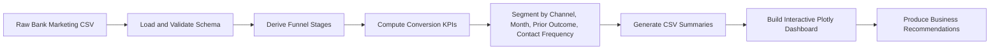
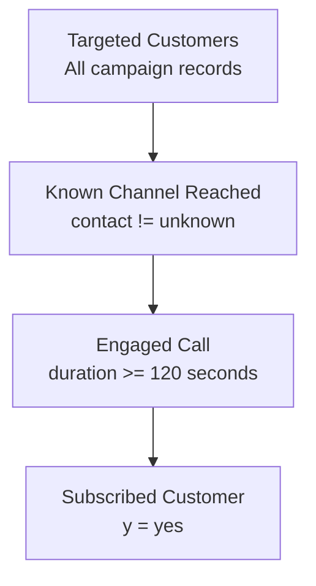
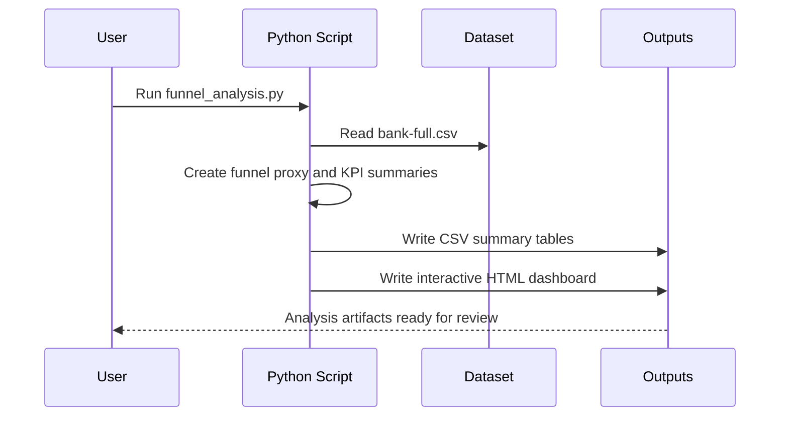

# Marketing Funnel & Conversion Performance Analysis


This project delivers a business-facing funnel analysis for the UCI Bank Marketing dataset. The objective is to identify where conversion breaks down, which campaign channels and segments produce stronger customer outcomes, and what operational actions should improve lead-to-customer conversion.

Because the dataset is campaign-oriented rather than web-session-oriented, the analysis uses a practical funnel proxy:

`Targeted customers -> Known channel reached -> Engaged calls (>=120 seconds) -> Subscribed customers`

## Executive Summary

- Overall subscription conversion is **11.7%** across **45,211** campaign records.
- The largest funnel drop-off occurs between **engaged calls and final subscription**, where only **16.24%** of engaged prospects convert.
- **Cellular outreach** is the strongest scalable channel at **14.92% conversion**, while records with **unknown contact channel** convert at only **4.07%**.
- Campaign fatigue is visible: conversion drops from **14.60%** on the **first contact** to **3.93%** after **11+ touches**.
- Historical relationship quality matters sharply: clients with **prior campaign success** convert at **64.73%**.

## Dashboard Preview

Open the generated dashboard after running the script:

- `outputs/marketing_funnel_dashboard.html`
- `docs/index.html` for the GitHub Pages presentation site

## Business Questions Answered

- Where are customers dropping out of the campaign funnel?
- Which channels bring better converting leads?
- Which months, customer segments, and prior outcomes outperform the average?
- How does contact intensity affect conversion efficiency?
- What changes should a marketing or sales team make next?

## Tech Stack

| Layer | Tool | Purpose |
|---|---|---|
| Data analysis | Python + Pandas | Cleaning, transformation, KPI computation |
| Visualization | Plotly | Interactive funnel and conversion dashboard |
| Documentation | Markdown + Mermaid | Architecture, workflow, and findings |
| Dataset | UCI Bank Marketing | Real-world telemarketing conversion data |

## Project Structure

```text
DS3/
├── README.md
├── architecture.md
├── projectdocumentation.md
├── requirements.txt
├── src/
│   └── funnel_analysis.py
└── outputs/
    ├── marketing_funnel_dashboard.html
    ├── funnel_stage_summary.csv
    ├── channel_performance.csv
    ├── month_performance.csv
    ├── prior_outcome_performance.csv
    ├── campaign_frequency_performance.csv
    ├── duration_performance.csv
    ├── job_performance.csv
    └── key_metrics.json
```

## Analysis Workflow



## Funnel Logic



## Key Findings

1. **Conversion loss concentrates late in the funnel.** Reach and engagement are acceptable compared with final subscription, so the closing conversation and offer fit need the most optimization.
2. **Channel quality is uneven.** `cellular` and `telephone` materially outperform `unknown`, which indicates poor or incomplete channel intelligence reduces marketing efficiency.
3. **Retargeting quality beats brute-force frequency.** Previous campaign success is the strongest lift factor, while excessive repeated contacts correlate with falling returns.
4. **Seasonality is significant.** March, September, October, and December show very high conversion rates, although some months have smaller volumes and should be interpreted with sample-size context.

## Recommendations

1. Prioritize outreach lists with known mobile contact details and reduce dependence on low-information records.
2. Route high-probability cohorts, especially prior-success customers, into specialized retention or upsell playbooks.
3. Cap standard outreach cadence earlier and review records after 4 to 5 unsuccessful touches instead of continuing low-yield contact loops.
4. Improve call scripting for engaged prospects because that stage still loses most opportunities.
5. Use seasonal test plans to shift more budget toward stronger months while validating whether the uplift persists at higher volume.

## Execution Flow



## Setup

1. Install dependencies:

```bash
pip install -r requirements.txt
```

2. Run the analysis:

```bash
python src/funnel_analysis.py
```

3. If your dataset is stored elsewhere, provide it explicitly:

```bash
python src/funnel_analysis.py --dataset "C:/path/to/bank-full.csv"
```

## Deliverables Produced

- Interactive funnel dashboard in HTML
- GitHub Pages microsite with advanced visual storytelling
- CSV summaries for funnel, channels, months, prior outcomes, campaign frequency, duration, and jobs
- Documentation for portfolio, GitHub, and stakeholder sharing

## GitHub Pages

This repository includes a static GitHub Pages site under `docs/` and a deployment workflow at `.github/workflows/deploy-pages.yml`.

After pushing to `main`, GitHub Actions deploys the contents of `docs/` as a public site. The analysis script refreshes the site data automatically by writing:

- `docs/data/dashboard_data.json`
- `docs/plotly-dashboard.html`

If Pages is not already enabled in repository settings, set the source to **GitHub Actions**.

## Dataset Citation

Please cite the original source when publishing or sharing the work:

S. Moro, R. Laureano and P. Cortez. *Using Data Mining for Bank Direct Marketing: An Application of the CRISP-DM Methodology.* In P. Novais et al. (Eds.), Proceedings of the European Simulation and Modelling Conference - ESM'2011, pp. 117-121, Guimarães, Portugal, October, 2011.

UCI dataset entry:

Moro, S., Rita, P., & Cortez, P. (2014). *Bank Marketing* [Dataset]. UCI Machine Learning Repository. https://doi.org/10.24432/C5K306