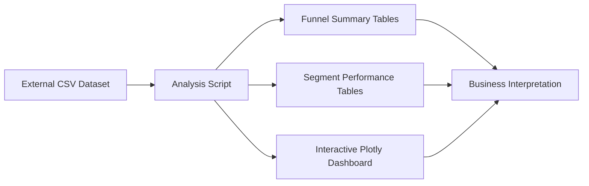
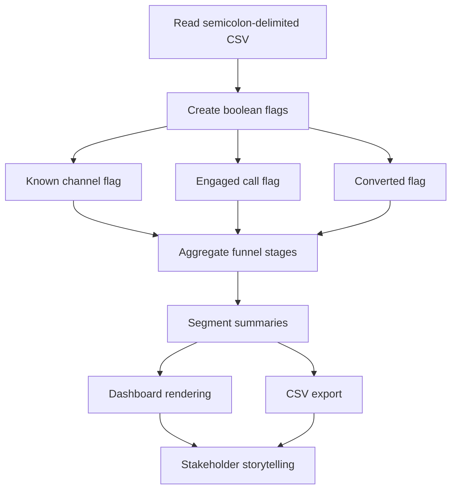
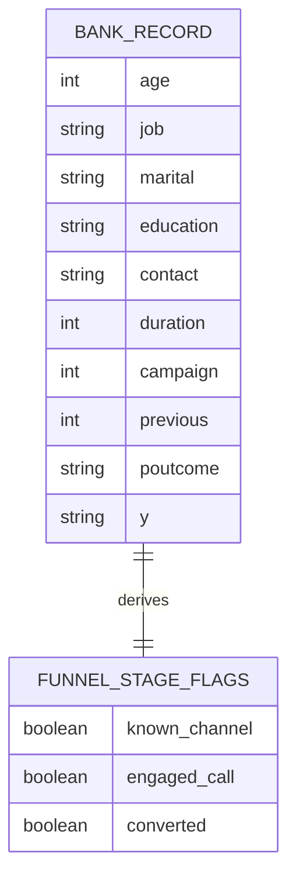

# Architecture Overview

This project is intentionally lightweight: one reproducible Python pipeline, structured CSV outputs, and a stakeholder-ready HTML dashboard. The design focuses on traceability from raw records to business recommendations.

## System Architecture

## Component Map

| Component | Responsibility | Output |
|---|---|---|
| `src/funnel_analysis.py` | Loads data, derives funnel stages, computes KPIs, exports outputs | CSV tables, HTML dashboard, JSON metrics |
| `outputs/funnel_stage_summary.csv` | Stage counts, conversion, and drop-off | Funnel KPI source |
| `outputs/channel_performance.csv` | Channel-level conversion and call metrics | Channel quality analysis |
| `outputs/month_performance.csv` | Monthly conversion performance | Seasonality analysis |
| `outputs/prior_outcome_performance.csv` | Conversion by previous campaign result | Retargeting / CRM signal |
| `outputs/campaign_frequency_performance.csv` | Conversion by number of touches | Cadence optimization |
| `outputs/duration_performance.csv` | Conversion by talk-time bucket | Sales conversation quality signal |
| `outputs/marketing_funnel_dashboard.html` | Interactive dashboard | Executive review artifact |

## Processing Flow

## Design Rationale

| Decision | Reason | Trade-off |
|---|---|---|
| Use Python instead of BI-only tooling | Fully reproducible, portable, and GitHub-friendly | Slightly more setup than a drag-and-drop dashboard |
| Use Plotly HTML dashboard | Easy sharing without server deployment | Less enterprise governance than Power BI/Tableau |
| Build a funnel proxy | Dataset does not contain explicit website visitor and lead events | Requires clear documentation of stage assumptions |
| Export CSV summaries | Makes the analysis auditable and reusable in Excel, Power BI, or Tableau | Adds a few more generated files |

## Data Model

## Data Flow Details

1. The script locates the dataset from either a user-provided path or a default candidate path.
2. The raw file is loaded with the correct semicolon delimiter.
3. Business-friendly flags are derived to approximate a marketing funnel from campaign records.
4. Aggregations are calculated across funnel stages, channels, months, prior outcomes, call duration buckets, and campaign frequency buckets.
5. Outputs are written to CSV for validation and to HTML for presentation.

## Scalability Notes

- The current dataset size is small enough for in-memory Pandas processing.
- The same structure can be extended to larger CRM exports by partitioning data by period or replacing Pandas with DuckDB/Polars if needed.
- Dashboard generation remains static and portable, which is ideal for internship submissions and GitHub portfolios.

## Risks and Assumptions

1. Funnel stages are inferred from campaign attributes, not captured as a full digital funnel event stream.
2. Month-level spikes in smaller months such as December and March may reflect limited volume, so budget decisions should combine rate and volume.
3. Contact duration is informative but should not be treated as a purely causal predictor because successful calls naturally tend to last longer.