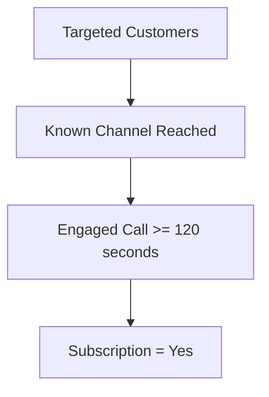
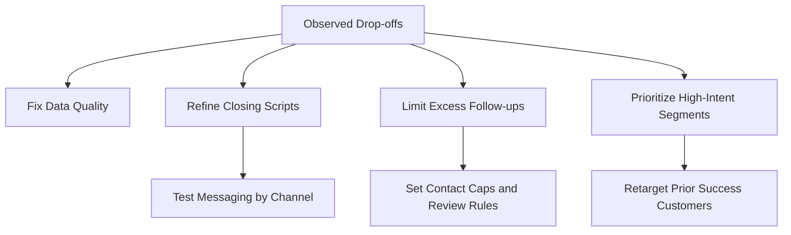
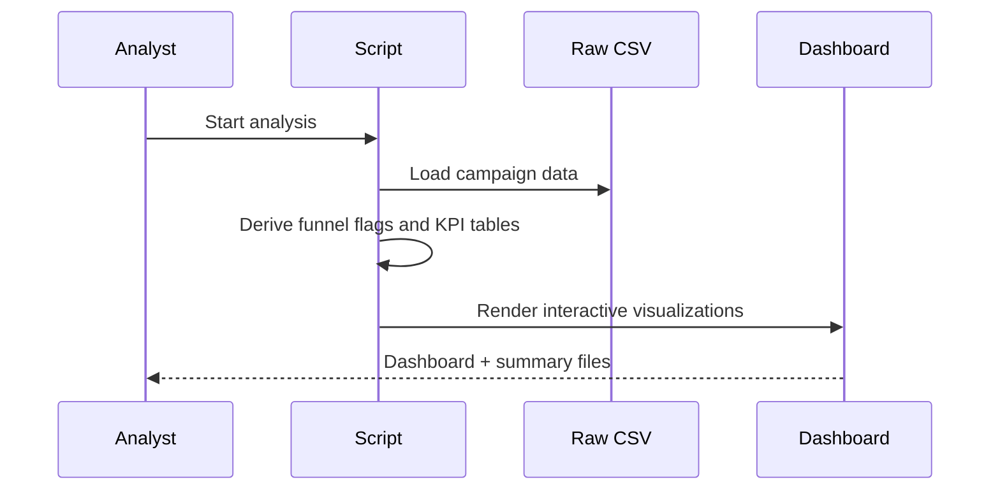

# Project Documentation

## Objective

The purpose of this project is to analyze campaign conversion performance and identify opportunities to increase subscriptions in a bank direct-marketing workflow. The work is aligned to Future Interns Data Science & Analytics Task 3 and focuses on measurable business improvement rather than descriptive charts alone.

## Problem Statement

Marketing and sales teams often know how many customers were contacted, but they struggle to isolate where the real conversion friction appears. This project addresses four questions:

1. Where does the biggest drop-off happen in the campaign funnel?
2. Which outreach channels create higher-quality conversions?
3. How do seasonality, prior outcomes, and contact intensity affect performance?
4. What should the business change first to improve conversion efficiency?

## Methodology

### Step 1: Data Understanding

The Bank Marketing dataset contains 45,211 campaign records from phone-based direct marketing by a Portuguese bank. The target variable is whether a client subscribed to a term deposit.

### Step 2: Funnel Definition

Because the dataset is not a digital-product event log, the analysis constructs a practical operational funnel:

This proxy preserves the spirit of funnel analysis while remaining honest about dataset limitations.

### Step 3: KPI Framework

The analysis tracks:

- Overall conversion rate
- Stage-to-stage conversion and drop-off
- Channel conversion rate
- Month conversion rate
- Prior campaign outcome conversion rate
- Conversion by number of contact attempts
- Conversion by call-duration bucket

## Key Metrics and Interpretation

| Metric | Value | Interpretation |
|---|---:|---|
| Overall conversion rate | 11.70% | Baseline probability of subscription |
| Known-channel reach | 71.20% | Nearly 29% of records lack a reliable contact channel classification |
| Engaged calls from known channels | 69.39% | Reach quality is decent once a usable channel exists |
| Customer conversion from engaged calls | 16.24% | The major bottleneck is closing after engagement |
| Best scalable channel | Cellular, 14.92% | Best outreach channel for ongoing investment |
| Worst channel | Unknown, 4.07% | Low-information records are materially weaker |
| Prior success segment | 64.73% | CRM history is the strongest targeting signal |
| 1 contact conversion | 14.60% | Early contacts are far more efficient |
| 11+ contacts conversion | 3.93% | Heavy retouching has poor return |

## Key Insights

### 1. The biggest drop-off is after call engagement

Most losses happen after prospects have already been engaged in meaningful conversations. This suggests the business should investigate offer framing, qualification, objection handling, pricing fit, or segment mismatch, rather than focusing only on top-of-funnel volume.

### 2. Channel data quality matters

Records with a known contact type convert far better than those with `unknown` contact classification. Better contact governance and list hygiene should increase usable lead quality before any scripting change is tested.

### 3. More touches do not mean more conversions

The relationship between contact frequency and conversion is negative after the first few touches. Operationally, this suggests diminishing returns, prospect fatigue, or poor prioritization in follow-up workflows.

### 4. Prior campaign success is a high-value signal

Customers who converted in previous campaigns represent an obvious high-yield segment for targeted retention and remarketing strategies.

### 5. Timing matters

Certain months show very strong performance, although lower-volume months require careful interpretation. The right next step is controlled budget reallocation with holdout measurement, not blind scaling.

## Recommendations

1. Improve customer contact data completeness to reduce the high share of unknown-channel records.
2. Build a dedicated playbook for customers with successful prior outcomes, since that segment dramatically outperforms the average.
3. Introduce cadence rules that trigger review or escalation after 4 to 5 unsuccessful touches.
4. Audit call scripts and sales enablement for engaged calls, because that is where the largest conversion leak occurs.
5. Run seasonal A/B campaign scheduling tests around higher-performing months to confirm whether the uplift generalizes.

## Execution Workflow

## Validation Strategy

1. Confirm row counts and target totals match the original CSV.
2. Reconcile stage counts with derived boolean flags.
3. Check that conversion summaries align across the exported CSV files and the dashboard.
4. Review high-performing segments for sample-size bias before translating them into budget decisions.

## Production Readiness

This project is portfolio-ready and reproducible. To make it production-ready in a business environment, the next steps would be:

1. Replace the single static CSV with scheduled CRM or campaign-system extracts.
2. Add automated data validation and freshness checks.
3. Push outputs to a BI layer such as Power BI or Tableau for stakeholder filtering.
4. Add lead source, campaign, and revenue fields to move from conversion rate optimization to ROI optimization.

## Citation

S. Moro, R. Laureano and P. Cortez. *Using Data Mining for Bank Direct Marketing: An Application of the CRISP-DM Methodology.* In P. Novais et al. (Eds.), Proceedings of the European Simulation and Modelling Conference - ESM'2011, pp. 117-121, Guimarães, Portugal, October, 2011.

Moro, S., Rita, P., & Cortez, P. (2014). *Bank Marketing* [Dataset]. UCI Machine Learning Repository. https://doi.org/10.24432/C5K306